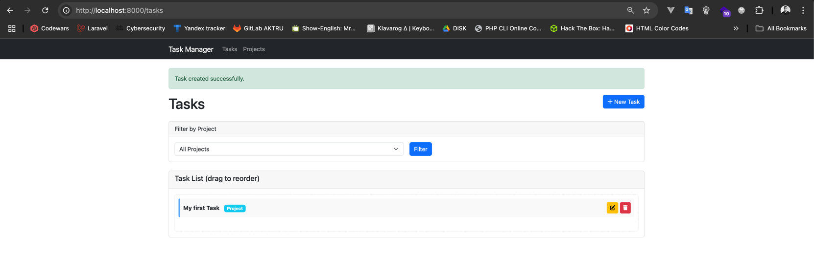

# Task Management Application

A simple Laravel task management application built with Docker that allows you to create, organize, and prioritize tasks with drag-and-drop functionality.


## Features

- Create, edit, and delete tasks
- Drag and drop interface to reorder tasks (priorities update automatically)
- Project organization for tasks
- Filter tasks by project
- Clean, responsive interface

## Requirements

- Docker and Docker Compose

## Installation and Setup

1. Clone the repository
```bash
git clone <repository-url>
cd task-manager
```

2. Create the `.env` file for Docker
```bash
cp .env.example .env
```

3. Start Docker containers
```bash
docker-compose up -d
```

4. Install composer dependencies
```bash
docker-compose exec app composer install
```

5. Generate application key
```bash
docker-compose exec app php artisan key:generate
```

6. Run database migrations
```bash
docker-compose exec app php artisan migrate
```

7. Set proper permissions
```bash
docker-compose exec app chmod -R 777 storage bootstrap/cache
```

## Accessing the Application

Once the installation is complete:

1. Open your web browser and navigate to [http://localhost:8000](http://localhost:8000)
2. You'll be directed to the task management dashboard

## How to Use

### Managing Projects

1. Click on "Projects" in the top navigation bar
2. Create a new project by clicking the "New Project" button
3. Enter a project name and click "Create Project"
4. Edit a project by clicking the edit icon
5. Delete a project by clicking the trash icon (this will also delete all associated tasks)

### Managing Tasks

1. The main dashboard displays all your tasks ordered by priority
2. Create a new task:
   - Click the "New Task" button
   - Enter a task name
   - Optionally select a project from the dropdown
   - Click "Create Task"
3. Edit a task by clicking the edit icon
4. Delete a task by clicking the trash icon
5. Reorder tasks by dragging and dropping them in the list
   - The priority will automatically update (top task is #1 priority)

### Filtering Tasks

1. Use the project dropdown filter at the top of the task list
2. Select a project to view only tasks associated with that project
3. Select "All Projects" to view all tasks
4. Click "Filter" to apply the filter
5. Click "Clear" to reset the filter
